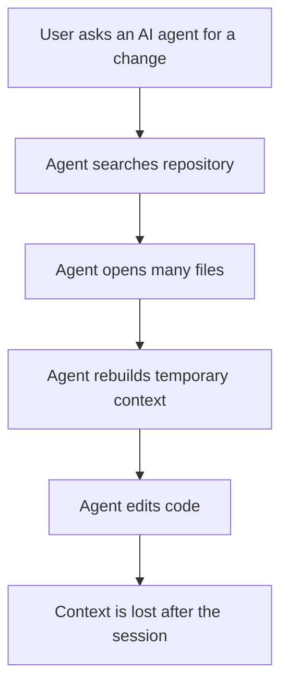
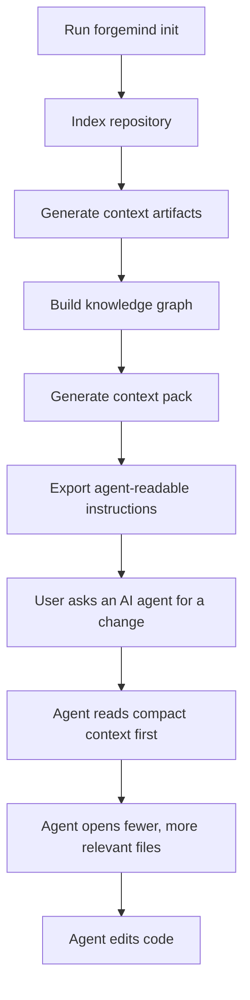
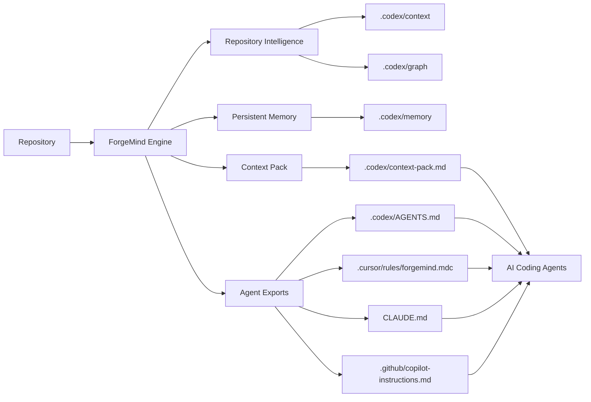

# ForgeMind

Repository Intelligence Engine for AI coding agents.

ForgeMind builds local repository intelligence that AI coding assistants can read before exploring source code. It indexes files, summarizes architecture signals, records durable engineering memory, builds a deterministic knowledge graph, and exports compact context to multiple agents.

ForgeMind supports:

- Codex
- Cursor
- Claude Code
- GitHub Copilot


## Why ForgeMind

AI coding agents often spend time rediscovering repository structure, reading unrelated files, and rebuilding context across sessions. ForgeMind prepares compact, local context so agents can start from repository intelligence instead of broad exploration.

The source code remains the source of truth. Generated context is advisory.

## Three Pillars

### Repository Intelligence

- Repository indexing
- Architecture and file mapping
- Symbol extraction
- Route hints
- Dependency summaries
- Knowledge graph generation

### Persistent Memory

- Sessions
- Decisions
- Failures
- Fixes
- Rationale
- Handoff notes

### AI Context Delivery

- Context packs
- Task-specific relevant context
- Cross-agent memory exports
- Local-only optional LLM compression

## Before ForgeMind



## After ForgeMind



## Architecture



## Installation

```bash
npm install -g forgemind
```

Local development:

```bash
npm install
npm link
forgemind --help
fgm --help
```

VS Code extension local development:

```bash
npm install
code .
```

Press F5, open a test folder in the Extension Development Host, then run ForgeMind commands from the Command Palette.

## Quick Start

```bash
forgemind init
forgemind ask "what handles authentication?"
forgemind pack
forgemind doctor
```

With NPX:

```bash
npx forgemind init
npx forgemind ask "what breaks if I change authentication?"
```

## Primary CLI Commands

| Command | What it does |
| --- | --- |
| `forgemind init` | Safely syncs project files, upgrades instructions, creates memory, indexes the repository, builds the graph, generates a context pack, and prints a doctor summary. |
| `forgemind index` | Generates `.codex/context/*` artifacts. |
| `forgemind ask "<question>"` | Generates task-specific `.codex/context/relevant.md` from the existing index. |
| `forgemind pack` | Generates `.codex/context-pack.md` from context, graph, and memory artifacts. |
| `forgemind memory` | Accesses session, decision, failure, compression, and memory doctor commands. |
| `forgemind graph` | Builds, queries, inspects, or cleans the knowledge graph. |
| `forgemind export` | Exports context and memory pointers to supported AI agents. |
| `forgemind doctor` | Checks project setup and optional memory/context-pack status. |
| `forgemind debug` | Prints OS, Node, CLI, AGENTS, context, graph, memory, and log diagnostics. |

`fgm` is an alias for `forgemind`.

## Advanced Commands

| Command | Purpose |
| --- | --- |
| `forgemind context doctor` | Validate generated context artifacts. |
| `forgemind context clean` | Delete only `.codex/context`. |
| `forgemind context pack` | Alias for `forgemind pack`. |
| `forgemind memory snapshot` | Append a session snapshot to `.codex/memory/sessions.md`. |
| `forgemind memory decision "<text>" --reason "<reason>" --files "<files>"` | Record a durable decision. |
| `forgemind memory failure "<text>" --cause "<cause>" --fix "<fix>" --files "<files>"` | Record a failed attempt and useful fix notes. |
| `forgemind memory compress --provider ollama --model qwen3:4b` | Explicitly compress `context-pack.md` with local Ollama. |
| `forgemind memory compress doctor` | Check optional local Ollama compression. |
| `forgemind memory doctor` | Validate repository memory files. |
| `forgemind graph build` | Build `.codex/graph/graph.json` and `.codex/graph/graph.md`. |
| `forgemind graph impact <file-or-symbol>` | Generate `.codex/graph/impact.md`. |
| `forgemind graph query "<question>"` | Generate `.codex/graph/query.md`. |
| `forgemind graph doctor` | Validate graph artifacts. |
| `forgemind graph clean` | Delete only `.codex/graph`. |
| `forgemind export codex` | Update `.codex/AGENTS.md` managed export block. |
| `forgemind export cursor` | Write `.cursor/rules/forgemind.mdc`. |
| `forgemind export claude` | Update `CLAUDE.md` managed export block. |
| `forgemind export copilot` | Update `.github/copilot-instructions.md` managed export block. |
| `forgemind export all` | Export all supported agent files. |
| `forgemind export doctor` | Validate existing agent export files. |
| `forgemind sync` | Create missing project context files without overwriting existing files. |
| `forgemind upgrade` | Update only the managed project instruction block. |

Compatibility note: `codex-context-init` remains as a deprecated alias that delegates to `forgemind`.

## Generated Files

ForgeMind currently stores repository intelligence under `.codex/` for compatibility with existing agent workflows. Future releases may support configurable storage locations.

| File | Purpose |
| --- | --- |
| `.codex/AGENTS.md` | Project instructions for agents that read AGENTS.md. |
| `.codex/context/index.json` | Machine-readable deterministic index. |
| `.codex/context/summary.md` | Compact repository overview. |
| `.codex/context/files.md` | Human-readable file map. |
| `.codex/context/symbols.md` | Detected symbols, exports, components, classes, functions, and headings. |
| `.codex/context/dependencies.md` | Dependency and script summary. |
| `.codex/context/routes.md` | Heuristic route hints. |
| `.codex/context/recent_changes.md` | `git status --short` when available. |
| `.codex/context/relevant.md` | Task-specific shortlist generated by `forgemind ask`. |
| `.codex/context-pack.md` | Compact agent-friendly context bundle. |
| `.codex/memory/sessions.md` | Automated and manual session records. |
| `.codex/memory/decisions.md` | Durable decisions. |
| `.codex/memory/failures.md` | Failed attempts, causes, fixes, and affected files. |
| `.codex/memory/fixes.md` | Fix notes. |
| `.codex/memory/rationale.md` | Durable rationale and handoff notes. |
| `.codex/memory/session_summary.md` | Optional local LLM-compressed session summary. |
| `.codex/graph/graph.json` | Machine-readable repository knowledge graph. |
| `.codex/graph/graph.md` | Human-readable graph summary. |
| `.codex/graph/impact.md` | Impact report for a file or symbol. |
| `.codex/graph/query.md` | Deterministic graph query report. |
| `.cursor/rules/forgemind.mdc` | Cursor export. |
| `CLAUDE.md` | Claude Code export. |
| `.github/copilot-instructions.md` | GitHub Copilot export. |

## VS Code Extension

Command Palette commands:

- ForgeMind: Init Workspace
- ForgeMind: Index Workspace
- ForgeMind: Ask Repository
- ForgeMind: Generate Context Pack
- ForgeMind: Doctor
- ForgeMind: Build Knowledge Graph
- ForgeMind: Export Memory to All Agents

The extension uses the same shared core logic as the CLI.

## Safety

- Local-first operation.
- No remote API calls during normal commands.
- Optional LLM compression runs only when explicitly invoked.
- Ollama compression defaults to `http://localhost:11434`.
- Secret files are ignored, including `.env`, `.env.*`, `*.pem`, `*.key`, `id_rsa`, `id_ed25519`, `secrets.*`, and `credentials.*`.
- Large files are skipped.
- `sync` never overwrites existing files.
- Managed instruction blocks preserve user content outside markers.
- Context packs are assembled from generated summaries and memory, not direct source dumps.
- Source code remains the source of truth.

## Limitations

- Parser heuristics are deterministic and intentionally simple.
- ForgeMind is not a vector database.
- ForgeMind does not create embeddings.
- ForgeMind does not inject context directly into agent runtimes.
- Generated context can become stale unless re-indexed.
- Knowledge graph links are heuristic, not semantic AI reasoning.
- Agent exports depend on each assistant honoring local instruction files.

## Troubleshooting

```bash
forgemind doctor
forgemind context doctor
forgemind graph doctor
forgemind memory doctor
forgemind debug
```

Rebuild generated context:

```bash
forgemind context clean
forgemind graph clean
forgemind index
forgemind graph build
forgemind pack
```
